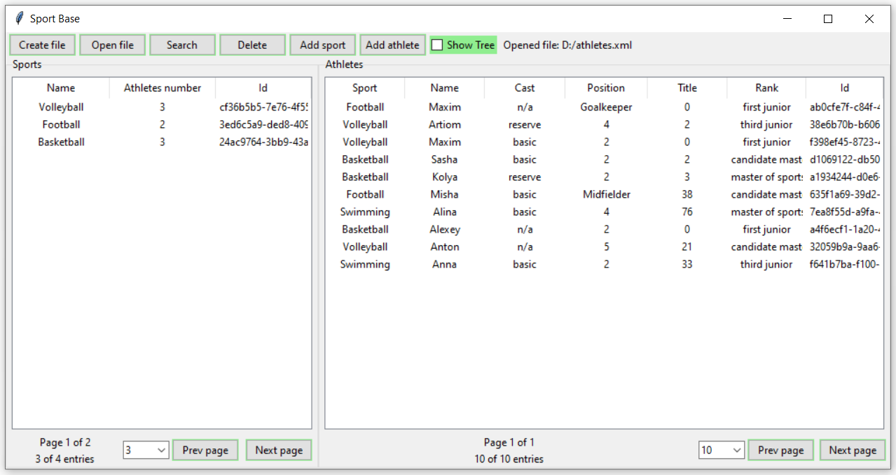
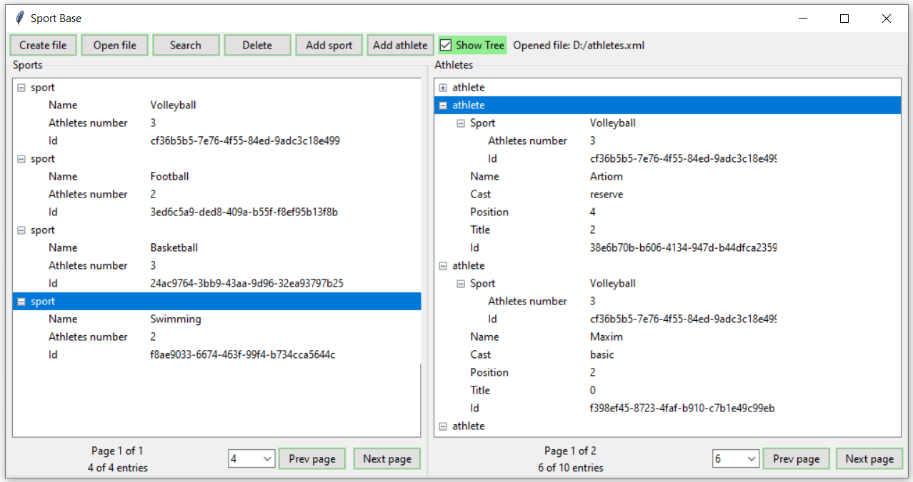

<h1 align="center" >Лабораторная работа №2</h1>

<hr>

<a href="https://git.io/typing-svg"></a>

Для корректного выполнения программы следует установить настройки `requirements.txt`
с помощью команды:
`pip install -r requirements.txt`
<hr>
<a href="https://git.io/typing-svg"></a>

Программа Sport Base предназначена для управления данными о различных видах спорта и спортсменах
с помощью графического интерфейса.

В данной программе реализован следующий функционал: 
```
- добавление вида спорта
- добавление спортсмена
- удаление спорсменов по заданному критерию
- поиск спортсменов по заданному критерию
- отображение записей в виде дерева
- постраничное отображение
```
Также программа поддерживает работу с форматами данных:
- `SQLite` 
- `XML-файл`
<hr>
<a href="https://git.io/typing-svg"></a>

### Главное окно приложения

Главное окно включает в себя основную область,
состоящую из двух таблиц: 

- Таблица Sports для просмотра видов спорта
- Таблица Athletes для просмотра спортсменов

Также имеется панель инструментов со всеми командами.



Реализована пагинация (навигация по таблицам осуществляется постранично).
Возможно выбрать, сколько записей отображается на странице, а также отображается число доступных для просмотра страниц.


С помощью галочки Show Tree


можно включить отображение записей в виде древовидной структуры.



---
### Окно создания файла
Для создания файла необходимо нажать на кнопку Create file


после чего откроется окно, в котором нужно указать тип файла,
а также указать имя


затем надо будет указать место, где будет создан файл


после создания файла файл будет уже открыт.

Также с помощью кнопки Open file


можно открыть уже созданный файл.

---
### Окно поиска спортсменов

Для поиска спортсменов по заданному критерию необходимо 
нажать на кнопку Search


после чего откроется окно, в котором нужно будет 
указать определённые критерии поиска.


Возможен поиск по:
```
- Имени спортсмена
- Виду спорта
- Количеству титулов
- Разряду
```
Результат поиска будет отображен в виде таблицы.


---
### Окно удаления спортсменов

Для удаления спортсменов по заданному критерию необходимо 
нажать на кнопку Delete


после чего откроется окно, в котором нужно будет 
указать определённые критерии удаления.


после нажатия на кнопку Delete


найденный спортсмен(спортсмены) будет удалён из таблицы Athletes.

---
### Окно добавления вида спорта

Для добавления вида спорта необходимо 
нажать на кнопку Add sport


после чего откроется окно, в котором нужно будет 
заполнить поле имя для добавления


после нажатия на кнопку Add 


вид спорта будет добавлен в таблицу Sports.


---
### Окно добавления спортсмена

Для добавления спортсмена необходимо 
нажать на кнопку Add athlete


после чего откроется окно, в котором нужно будет 
заполнить определённые поля для добавления


после нажатия на кнопку Add 


спортсмен будет добавлен в таблицу Athletes.


<hr>
<a href="https://git.io/typing-svg"></a>

Приложение разработано с использованием паттерна MVP с пассивной моделью.

Использована чистая архитектура:
```
- Уровень domain: модели данной предметной области.
- Уровень use cases: абстракции для работы с данными 
- Уровень infrastructure: реализации абстракций уровня use cases.
- Уровень presentation: элементы графического интерфейса, которые также зависят от use cases.
```