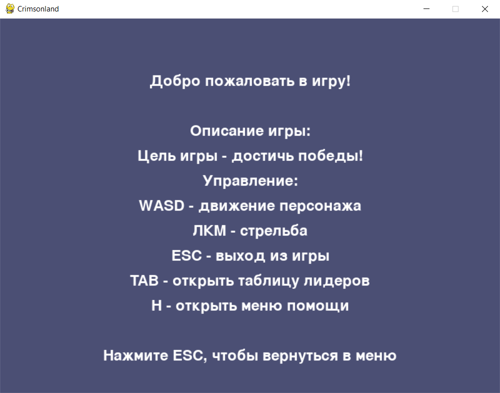

## Лабораторная работа №3

### Вариант: 7

### Цель:
Изучить событийно-ориентированное программирование с использованием библиотеки на языке Python (рекомендуется библиотека pygame)

### Задача - Crimsoland:
- Все волны врагов описать в конфигах. В игре должно быть не менее 20 волн
- Реализовать не менее 3 видов оружия
- Реализовать не менее 5 противников с различными характеристиками и поведением

### Демонстрация разработанной игры:

#### Главное меню:

В главном меню игрок может:
- начать игру
- открыть таблицу лидеров
- посмотреть информацию об игре
- выйти из игры

#### Таблица лидеров:

Таблица лидеров загружается из файла leaderboard.json

В случае, если игрок побьет самый лучший рекорд из файла с рекордами, он должен будет ввести свой никнейм, чтобы стать новым лидером.

#### Информация об игре:

#### Игра:

##### Волны:

Вся информация про волны хранится в файле waves.json

каждая волна содержит 5 полей, которые означают, как часто будет спавниться враг(например для первой волны летучая мышь будет спавниться раз в 1 секунду)

##### Оружие:

Было реализовано 4 вида оружия: Pistol, Deagle, AK47, UZI. Каждое оружие имеет свой урон, скорость стрельбы, точность, кд, изображение.

Оружие может заспавниться на карте в определенное время. Чтобы пользователь смог получить его, он должен подойти к лежащему оружию.

##### Враги:

Было реализовано 5 видов врагов со своими характеристиками и особенностями.

При убийстве врага, будет отрисовываться соответствующий спрайт.

### Вывод:

В процессе написания я рассмотрел различные аспекты работы с Pygame, такие как отображение изображений, обработка событий мыши и клавиатуры, а также воспроизведение звуков и музыки.
Помимо этого познакомился с практиками хранения игровых состояний (например информацию о волнах) в файлах(в моем случае в json).

