## Лабораторная работа №4

### Вариант: 19

### Цель: 
- Изучить архитектурные приемы построения пользовательского интерфейса и принципы создания веб-приложений
### Задача: Модель рыболовного произвоодства
- Предметная область: процесс вылова и переработки рыбы на рыбопромыслах.
- Важные сущности: рыболовное производство, рыбак, рыба, судно, сеть, хладокомбинат, рынок рыбной продукции
- Операции: операция вылова рыбы, операция хранения и транспортировки, операция переработки рыбы, операция управления производством, операция продажи рыбной продукции.

### Используемые технологии
- Django: фреймворк для создания веб-приложений на языке Python.
- HTML/CSS: для оформления пользовательского интерфейса.
- Jinja: шаблонизатор для языка Python
- Bootstrap: библиотека для быстрой и удобной верстки веб-страниц с адаптивным дизайном.

### Функционал приложения
#### Главная страница:
На главной странице пользователь может выбрать то, что он хочет сделать с производством.
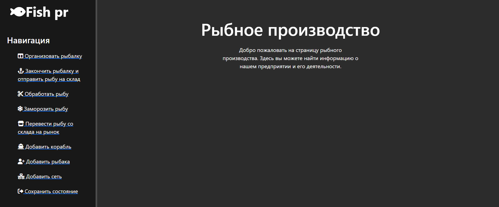

#### Организация рыбалки:
- Выбор судна, рыбаков и сетей для вылова.
- Начало процесса вылова рыбы.
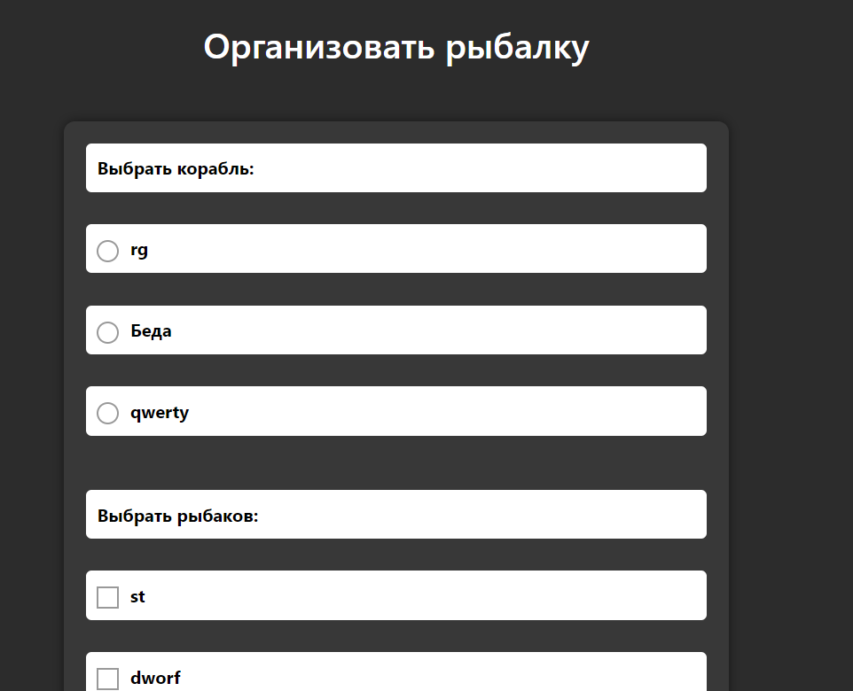

#### Завершение рыбалки и отправка рыбы на склад:
- Завершение вылова рыбы.
- Отправка пойманной рыбы на хранение в хладокомбинате.
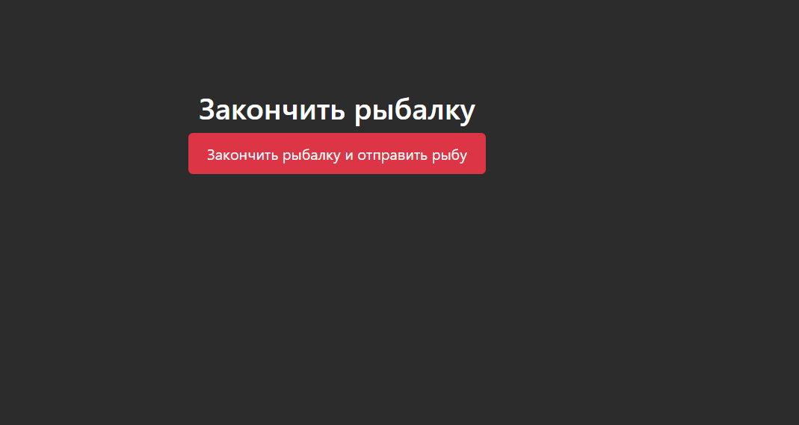

#### Обработка рыбы:
- Переработка пойманной рыбы на хладокомбинате.
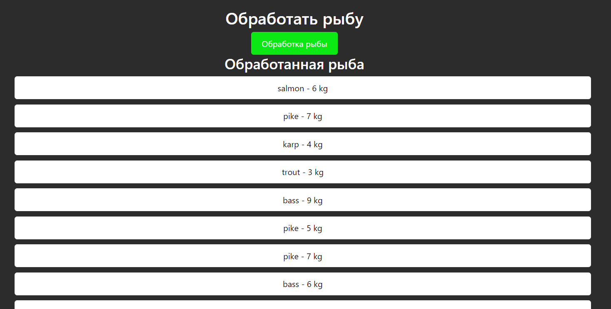

#### Заморозка рыбы:
- Заморозка переработанной рыбы для дальнейшего хранения и транспортировки.
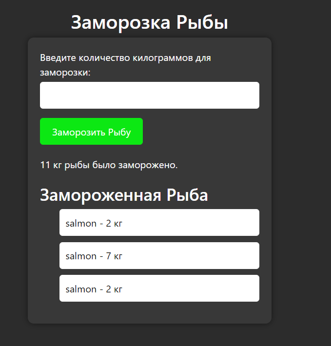

#### Перевод рыбы со склада на рынок:
- Перевод замороженной рыбы со склада на рынок для продажи.
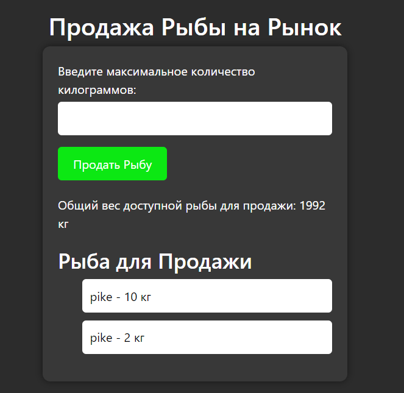

#### Управление составом:
- Добавление новых кораблей, рыбаков и сетей.
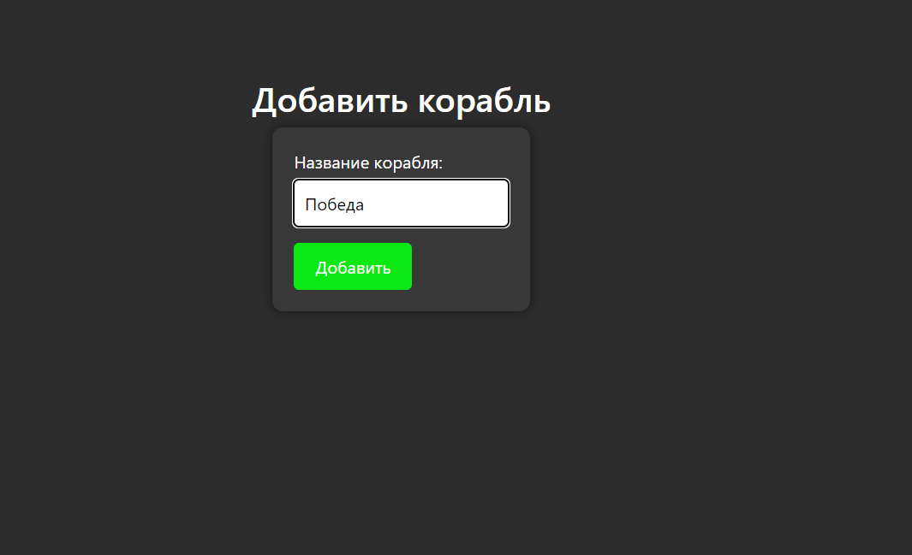

#### Сохранение состояния:
- Возможность сохранения текущего состояния системы.
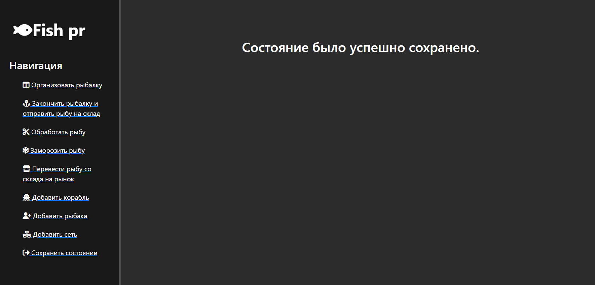

### Пример метода:

В методе по добавлению сети, пользователь через форму вводит площадь для новой сети, которая уже через код 1-ой лабораторной работы добавляется в модель.
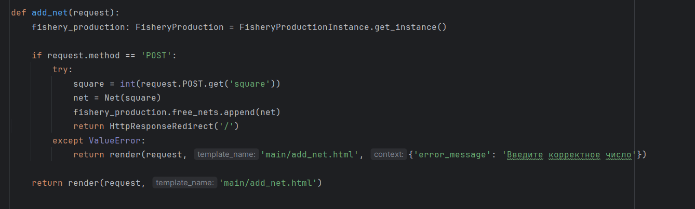

Для того чтобы связать ULR-адрес с методом в приложени в Django нужно добавить его в массив urlpatterns

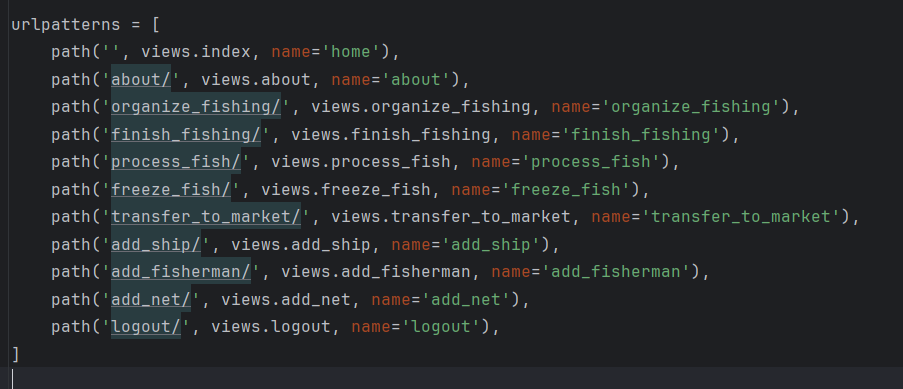

Далее метод должен вернуть какое-то представление пользователю(например JSON, картинки и т.д.) в моем случае сервер возращает HTML-страницу.

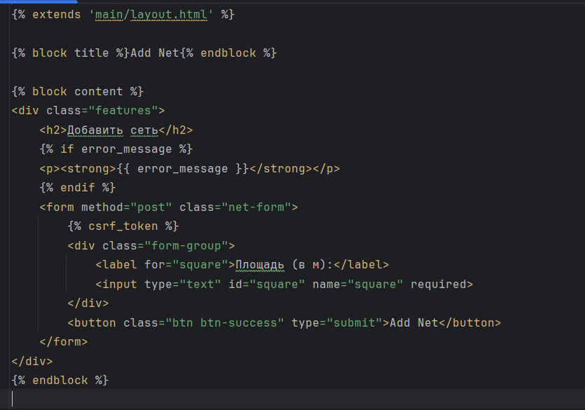

### Вывод:
Таким образом, каждое действие представлено соответствующей страницей, где пользователь может взаимодействовать с интерфейсом через формы или ссылки. Пример метода был представлен для операции по добавлению новой сети. Разработанное веб-приложение предоставляет удобный интерфейс для управления рыболовным производством и выполняет поставленные задачи в предметной области.