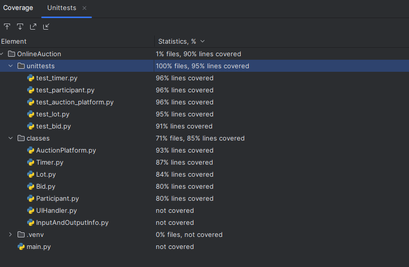

# Лабораторная работа №1
### Цель:
---
* Изучить основные возможности языка Python для разработки программных систем с интерфейсом командной строки (CLI)
* Разработать программную систему на языке Python согласно описанию предметной области
### Задача:
---
Разработать программную систему с интерфейсом командной строки на языке Python, которая реализует работу модели __онлайн-аукциона__

__Предметная область:__ интернет-торговля с использованием аукционных площадок.

__Важные сущности:__ лот, участник аукциона, ставка, торговая площадка, таймер.

__Операции:__ операция размещения лота, операция участия в торгах, операция управления ставками, операция завершения аукциона, операция оформления победы и платежей.

### Описание работы программы:
---
В ходе проектирования были выделенны следующие сущности.
#### Выделенные сущности:
* Класс Lot (Лот)
* Класс Participant (Участник аукциона)
* Класс Bid (Ставка)
* Класс Timer (Таймер)
* Класс AuctionPlatform (Торговая площадка)
* Класс UIHandler (Обработчик пользовательского интерфейса)
* Класс InputAndOutputInfo (Обработчик ввода и вывода информации)
---
#### Класс Lot
Класс, который представляет собой _лот_, предмет для онлайн торговли на аукционе, который имеет _название_, _начальную цену_ и _ставку_, которая является объектом класса _Bid_ 

##### Методы:

* \_\_init__(self, name)

Конструктор, для создания торгового лота с указанным именем.

---
#### Класс Participant
Класс, отражающий _участника аукциона_ и имеющий _номер_, под которым зарегистрирован участик, _имя_ и _сумму денег_, которую можно потратить.

##### Методы:

* \_\_init__(self, number, name)

Конструктор, для создания участника аукциона с указаным порядковым номером и именем.

* raise_price(self, price, bid)

Функция для повышение текущей цены лота на установленную ставку во время торгов с учетом возможности повышения посредством наличия необходимой суммы денег.

* pay_money(self, cost)

Функции оплаты установленной стоимости в случае выйграша лота.

---
#### Класс Bid
Класс, реализующий _ставку_, на которую повышается стоимость лота аукциона во время торгов.

##### Методы:

* \_\_init__(self, bid)

Конструктор для создания ставки для повышения цены лота.

---

#### Класс Timer
Класс, который реализует работу со временем. Представляет собой _таймер_, для которого устанавливается _время_ в секундах, отведенное для проведения аукциона.

##### Методы:

* \_\_init__(self, duration)

Конструктор для создания таймера с определнным временем работы.

* reset(self)

Функция, которая сбрасывает таймер.

* def stop(self)

Функция остановки таймера.

* run(self)

Функция, реализующая работу таймера.

---
#### Класс AuctionPlatform

Класс, который представляет собой _торговую площадку_, на которой проводится _аукцион_. Торговая площадка имеет _список продаваемых лотов_, _список зарегистрированных участников_ и _таймер_ с отведенным временем для проведения.

##### Методы:

* \_\_init__(self)

Конструктор для создания аукциона.

* def add_lot(self, name, price, bid)

Функция, добавляющая новый лот с заданным именем, начальное ценой и ставкой.

* def add_participant(self, name, money)

Функция для регистрации нового участника аукциона с заданным именем и суммой денег. Номер участника определяется программой автоматические в зависимости от порядка записи участников.

* def install_timer(self, duration)

Функция, устанавливающая заданное время для проведения аукциона.

---
#### Класс UIHandler
Класс отвечающий за организацию и проведение _аукционов_ через взаимодействие с пользователем с помощью интерфейса.

##### Методы:

* \_\_init__(self)

Конструктор для создания пользовательского интерфейса.

* menu_preparing(self)

Функция, которая выводит на экран меню подготовки аукциона и возвращает алгоритм для дальнейших действий.

* def choice_create_lot(self)

Функция, которая запрашивает у пользователя всю нужную информацию для создания нового лота.

* def choice_create_participant(self)

Функция, которая запращивает у пользователя всю нужную информацию для регистрации нового участника аукциона.

*  def choice_reset_timer_duration(self)

Функция, которая запрашивает время для установки пользовательского време проведения аукциона.

* def choice_print_information(self)

Функция, которая вывод всю информацию о текущих приготовлениях к аукциону включая количество лотов и участников, отведеное время, и подробную информацию о всех всех участниках.

* def choice_run_auction(self)

Функция, которая отвечает за запуск и проведение аукциона полностью.

* handle_choice(self, choice)

Функция, которая выполняет алгоритм полученный от функции _menu_preparing().

* new_auction(self)

Функция для создания аукционов через интерфейс.

* main_menu_loop(self)

Функция, реализующая стадию организации аукциона.

* bidding(self, price, bid)

Функция, которая отвечает за реализацию торгов за лот определенной стоимости между всеми участниками аукциона посредством ставок.

* start_auction(self)

Функция, которая контролирует ход торгов и объявляет их результаты.

---
#### Класс InputAndOutputInfo
Класс, который отвечает за ввод и ввывод информации для пользователя, а также обработку исключительных ситуаций.

##### Методы:

* @staticmethod
    def print_info_of_auction(count_lots, count_participants, time)

Функция, которая выводит на экран информацию о текущей подготовке к аукциону: количество зарегистрированных лотов, количество зарегистрированных участников, время отведенное для проведения аукциона.

* @staticmethod
    def display_lot(lot_name, lot_price, lot_bid)

Функция, которая выводит на экран информацию об определенном лоте: название лота, начальную цену и ставку.

* def list_of_participants(participants)

Функция, которая выводит подробную информацию о всех учатниках, которые были зарегистрированы.

* @staticmethod
    def find_participants_for_bidding(participants, price)

Функуция, которая выводит на экран информацию об участниках, которые могут поучаствовать в торгах за определнный лот с текущей ценой. На экран выводится номер участника, имя и сумма денег.

* @staticmethod
    def winner_announcement(winner_index, lot_index, lot_name)

Функция, которая выводит на экран номер участника, победившего в торгах за лот под определенным номером и названием.

*  @staticmethod
    def winner_paid(winner_name, winner_money)

Функция, выводящая на экран сообщение об оплате участником-победителем конкретной суммы.

*  @staticmethod
    def numbers_input_check(input_message, min_value, max_value)

Функция для проверки ввода целого числа, который находится в определенном диапазоне чисел.

* @staticmethod
    def string_input_check()

Функция для проверки строки на содержание символов, отличных от букв.

* @staticmethod
    def find_participant(participant_number, count_participants)

Функция для проверки выбора существующего участника аукциона.

---
### Тестирование:

Программа прошла Unit-тестирование

---
### Вывод:
В результате выполнения лабораторной работы были изучены ключевые возможности языка Python для создания программ с интерфейсом командной строки. В рамках лабораторной работы была разработана программная система на языке Python, моделирующая функциональность Онлайн-аукциона. Также применялись навыки написания юнит-тестов, изученные в среде разработки Visual Studio.