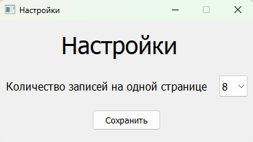

# Лабораторная работа №2
### Цель:
---
* Изучить принципы построения графического пользовательского интерфейса
* Разработать программную систему с графическим пользовательским интерфейсом на языке Python
### Задание:
---
Разработать оконное приложение с одним главным окном и несколькими дочерними диалогами. Вызов диалогов осуществляется через соответствующие пункты меню. Команды меню должны дублироваться на панели инструментов. 

---
### Вариант 13
Программа создана для работы с данными __о железнодорожных маршрутах__ (номер поезда, пункты отправления и прибытия, дата и время отправления и прибытия, время в пути). Взаимодействие с пользователем реализуется через графический интерфейс, и XML файлы. Реализованы функции сохранения данных в формате *.xml*, открытие сохраненых файлов, добавление новых записей, очищение данных, поиск и удаление по следующим параметрам:

* по номеру поезда
* по названию пункта отправления
* по названию пункта прибытия
* по дате отправления
* по времени отправления (задается промежуток)
* по времени прибытия (задается промежуток)
* по времени в пути (задается промежуток)

### Описание работы программы:
---
Приложение построено по шаблону проектирования MVC (Model-View-Controller)

#### Model:
* Класс Train (Поезд)
* Класс ScheduleOfTrains (Расписание поездов)

Данный модуль отвечает за работу с данными и безнес-логику.

---
#### View:
* Класс Ui_AddWindow (Графический интерфейс для диалогового окна добавления новых записей)
* Класс Ui_FindWindow (Графический интерфейс для диалогового окна поиска записей по заданным параметрам)
* Класс Ui_MainWindow (Графический интерфейс для главного окна)
* Класс MessageWindow (Графический интерфейс для вывода уведомлений об ошибках и информации)
* Класс Ui_RemoveWindow (Графический интерфейс для диалогового окна удаления записей по параметрам)
* Класс Ui_SettingWindow (Графический интерфейс для диалогового окна настроек главного окна)

Данный модуль отвечает за отображение данных для пользователя.

---
#### Controller:
* Класс Controller (Контролер)

Данный модуль отвечает взаимодействие модулей Model и View между собой.

---

### Демонстрация работы программы:
При запуске программы открывается *__Главное окно__*, на котором расположены кпопки для вызова различных диалоговых окон для работы с данными, такие как добавление, удаление и поиск, пустая таблица, а также панель инструментов.

На панеле инструментов продублированы все возможные действия, а также подписаны все возможные *горячие клавиши*.

При помощи панели инструментов *Файл->Открыть* или нажав *горячие клавиши Ctrl+O* можно вызвать окно для открытие заранее сохраненного файла в формате *.xml*

Также при помощи панели инструментов *Файл->Сохранить*, кпопки Сохранить в правом нижнем углу главного экрана или нажав *горячие клавиши Ctrl+S* можно вызвать окно для сохранение данных в файл формата *.xml*

Нажав на панели инструментов *Редактирование->Добавить запись*, кпопку со знаком "+" в правом вверхнем углу или при помощи горячих клавищ *Cntr+A* можно вызвать диалоговое окно для добавления новых записей.

При помощи панели инструментов *Файл->Очистить* или нажав *горячие клавиши Ctrl+O* можно полностью очистить таблицу данными.

Нажав на панели инструментов *Редактирование->Удалить запись*, кпопку со знаком "-" в правом вверхнем углу или при помощи горячих клавищ *Cntr+D* можно вызвать диалоговое окно для удаления записей по выбранному параметру.

Рассмотрим все параметры удаления записей:
* по номеру поезда

    

* по названию пункту отправления

    

* по названию пункту прибытия

    

* по дате отправления

    

* по времени отправления

    

* по времени прибытия

    

* по времени в пути

    

Нажав на панели инструментов *Редактирование->Поиск*, кпопку со знаком "?" d правом вверхнем углу или при помощи горячих клавищ *Cntr+F* можно вызвать диалоговое окно для добавления новых записей. При помощи выпадающего списка, можно выбрать параметр по которому пользователь хочет произвести поиск. Параметры поиска задаваемые пользователям соответствуют меню удаления.

Нажав на панели инструментов *Вид->Настройки* можно открыть диалоговое окно настроек главного меню, на котором можно изменить количество страниц, которое показывается на одной странице.

Пример изменения количества записей на одной странице.

Также после каждой успешно выполненой операции высвечивается выплывающее окно с информаций.

Также при каждом некорректном вводе информации высвечивается выплывающее окно с информаций об ошибке.

### Вывод:
В результате выполнения лабораторной работы были изучены ключевые возможности языка Python для создания программ с графическим интерфейсом. В рамках лабораторной работы была разработана окнонное приложение на языке Python.