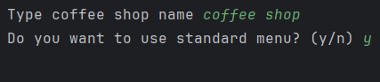
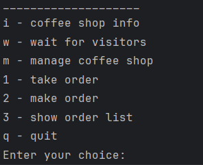
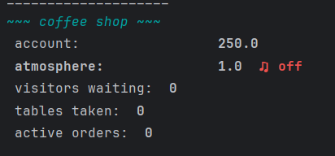
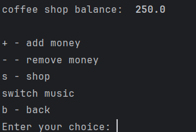
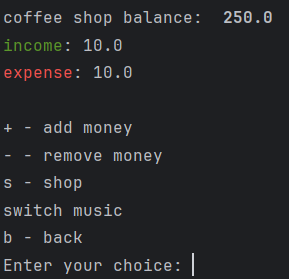
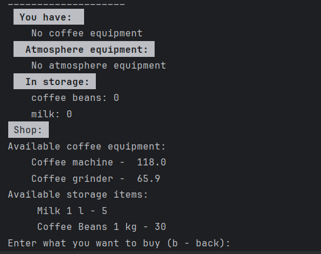
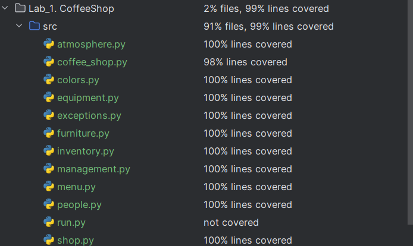

# Лабораторная работа №1

## Цель:

- Изучить основные возможности языка Python для разработки программных систем с интерфейсом командной строки (CLI)
- Разработать программную систему на языке Python согласно описанию предметной области

## Вариант 27 (Модель кофейни)

**Предметная область:** _организация и управление кофейней._

**Важные сущности:** _кофейня, бариста, посетитель, меню, кофейное оборудование, столы и стулья._

**Операции:** _операция приготовления кофейных напитков, операция обслуживания посетителей, операция управления запасами
и заказами, операция создания атмосферы, операция бухгалтерского учета._

___

**Выделены сущности:**

- [`СoffeeShop`](src/coffee_shop.py?CoffeeShop) - кофейня
- [`Atmosphere`](src/coffee_shop.py?Atmosphere) - атмосфера и действия над ней
- [`Management`](src/management.py?Management) - управление бухгалтерией и оборудованием заведения
- [`Barista`](src/people.py?Barista) - бариста
- [`Visitor`](src/people.py?Visitor) - посетитель
- [`Menu`](src/menu.py?Menu) - меню
- [`MenuItem`](src/menu.py?MenuItem) - позиция меню
    - [`Coffee`](src/menu.py?Coffee) - кофе (позиция меню)
    - [`Dessert`](src/menu.py?Dessert) - десерт (позиция меню)
- [`Order`](src/menu.py?Order) - заказ посетителя
- [`Equipment`](src/equipment.py?Equipment) - оборудование
    - [`CoffeeMachine`](src/equipment.py?CoffeeMachine) - кофемашина (оборудование)
    - [`CoffeeGrinder`](src/equipment.py?CoffeeGrinder) - кофемолка (оборудование)
- [`Inventory`](src/inventory.py?Inventory) - запасы и оборудование кофейни
- [`Table`](src/furniture.py?Table) - стол
- [`Chair`](src/furniture.py?Chair) - стул
- [`Shop`](src/shop.py?Shop) - (структура) магазин содержащий товары
- [`ShopPosition`](src/shop.py?ShopPosition) - позиция продающаяся в магазине

___

## Описание работы программы:

- Приветствие: При запуске пользователю предлагается ввести название кофейни и спрашивается, хочет ли пользователь
  использовать стандартное меню в кофейне:
  
- Главное меню: Здесь представлено меню с базовыми действиями в кофейне:
  
- Информация о кофейне: Показывает счет кофейни, текущий показатель атмосферы в ней и информацию о посетителлях
  
- Меню управления кофейней, показывает текущий баланс кофейни, историю операций и пункты для управления бухгалтерией, а
  так пункт для перехода в магазин
  
  
- Меню магазина: Позволяет приобрести товары и оборудование для кофейни
  

## Тестирование:

Программа успешно прошла unit-тестирование:

## Вывод:

В результате выполнения лабораторной работы были изучены ключевые возможности языка Python для создания программ с
интерфейсом командной строки.В рамках лабораторной работы была успешно разработана программная система на Python,
моделирующая функциональность кофейни. Это позволило понять применимость Python для разработки эффективных и удобных
CLI-приложений и создать работоспособную систему для управления задачами и данными в рамках модели кофейни.
