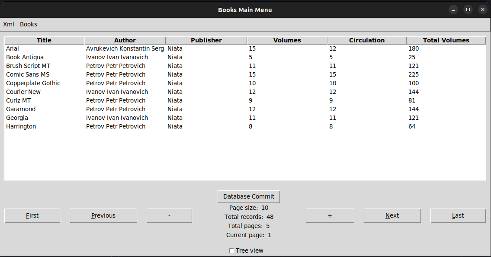
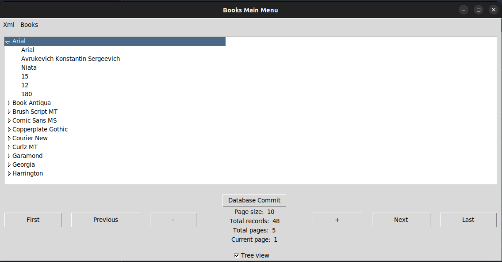
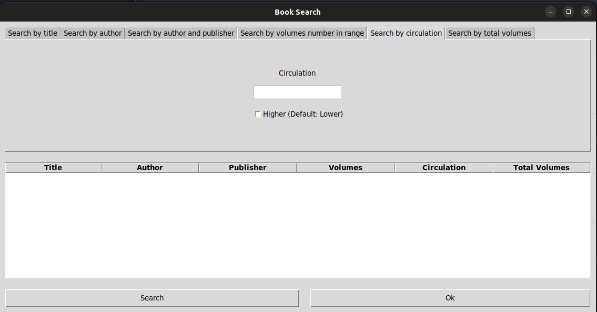
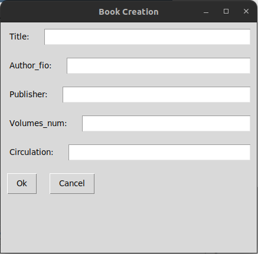

# Лабораторная работа 2
## Вариант 15

### Главное окно

Главное окно имеет в себе таблицу, содержащую все книги, а также команды для общей навигации по БД и остальные пункты меню

Навигация по таблицам осуществляется постранично. Возможно выбрать, сколько записей отображается на странице, а также отображается число доступных для просмотра страниц.

Чекбоксом Tree view можно включить отображение записей в виде древовидной структуры.

### Источники данных

При запуске, приложение сразу подгружает записи из базы данных MySQL
Также хранение возможно в .xml файлах

Можно сохранить записи на странице с помощью Xml -> Save to Xml, либо открыть существующий файл с помощью Xml -> Load from XML.

Сохранение изменений в БД происходмт с помощью кнопки Database Commit.

### Окно поиска

Для осуществления поиска книжек необходимо нажать кнопку Books -> Search books.

В диалоговом окне будет предложено включить определенные критерии поиска, а также указать ограничения.

Возможен поиск по:
- Названию книги
- Автору книги
- Автору и издательству книги
- Количеству томов в диапизоне от/до
- Тиражу с указанием, требуется ли найти книги с тиражом меньше/больше указанного значения
- Общему кол-ву томов с указанием, требуется ли найти книги с кол-вом меньше/больше указанного значения

После применения фильтра поиска найденые записи будут добавлены на окно поиска.

### Окно удаления

Логика работы окна удаления аналогична окну поиска. Критерии удаления совпадают с критериями поиска. Отличие заключается то, что после нажатия ОК будет предложено удалить записи.

### Добавление книги

Для добавления книги необходимо открыть БД, после чего нажать кнопку Books -> Add book. Будут предложены название, ФИО автора, издательство,
кол-во томов и тираж. Общее кол-во томов высчитывается автоматически и равно тиражу * кол-во томов.
