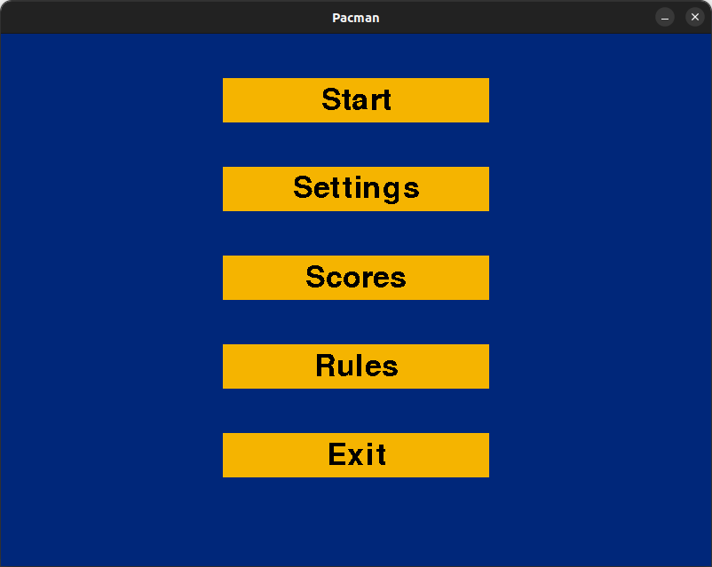
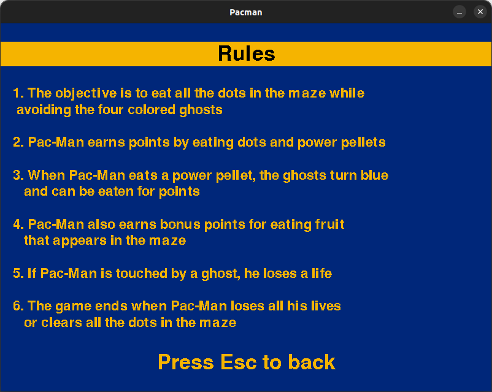
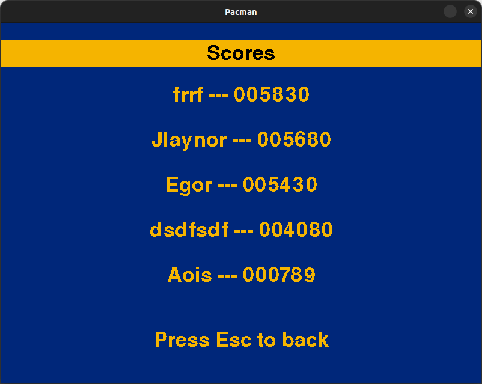
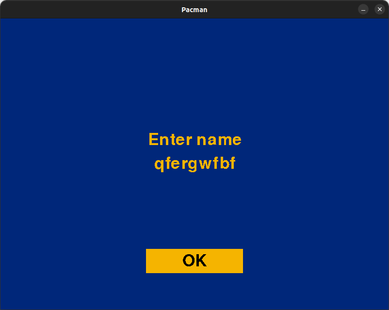
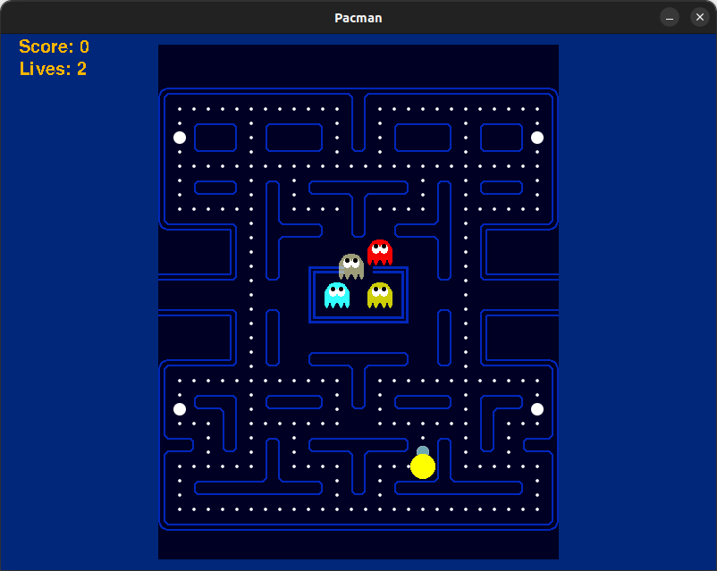

# Лабораторная работа 3

## Описание приложения

Pac-Man — аркадная видеоигра, разработанная японской компанией Namco и вышедшая в 1980 году. Задача игрока — управляя Пакманом, съесть все точки в лабиринте, избегая встречи с привидениями, которые гоняются за героем.

## Демонстрация работы

### Главное окно приложения

Главное меню предлагает пользователю начать игру, посмотреть справку по игре, зайти в настройки, посмотреть таблицу рекордов либо же выйти.

### Справка

Окно справки рассказывает правила игры.

### Таблица рекордов

В таблице рекордов отражены последние 5 лучших игр. По окончании игры игрока просят ввести имя для сохранения в таблице.

### Геймплей

Во время геймплея интерфейс отображает количество жизней, количество очков, а также спрайты поднятых фруктов в виде вишенок.

## Архитектура приложения

### Общие характеристики

В приложении используется библиотека pygame, в частности для отображения графики и для создания звуковых эффектов.
Приложение разработано с использованием паттерна MVC с активной моделью.

На слое model содержатся все игровые сущности и непосредственно модель игры со всей бизнес-логикой.
Controller отвечает за связь уровней и пользователя. Там обрабатываются события ввода.
View отвечает строго за отрисовку при поступлении event'ов с других слоев.

Для удобства коммуникации между слоями реализован класс EventManager, представляющий собой реализацию паттерна event bus.

Приложение как совокупность интерфейса и непосредственно игры представляет из собой стековую машину состояний.
За этот функционал отвечает класс StateMachine.

### Игра

Игра представляет из себя обработку логики над узлами. Для представления последних создан класс Node с методом position, позволяющим узнать 
позицию узла.
От Node унаследованы Wall, Road, Crossroad, Cookie, Poweup, Haste, Fruit, а также GameObject. GameObject представляет
из себя суперкласс для движущихся объектов на карте и имеет в себе такие методы, как move() и collision(). От GameObject
унаследованы Pacman и Ghost.

Визуальная часть игры представлена спрайтами. Они хранятся в папке resources, как и аудио-файлы для звуковых эффектов и фоновой музыки.

Часть логики реализована с помощью callback функций. Таким образом обеспечивается слабое зацепление классов: объекты не знают о спрайтах, при этом способны при своем уничтожении удалять свой спрайт.
