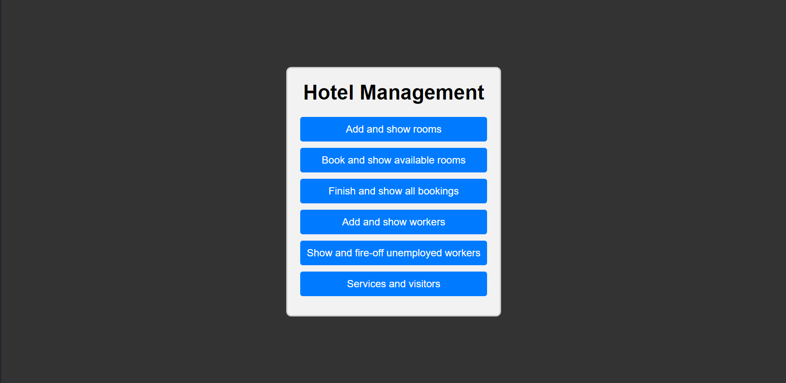
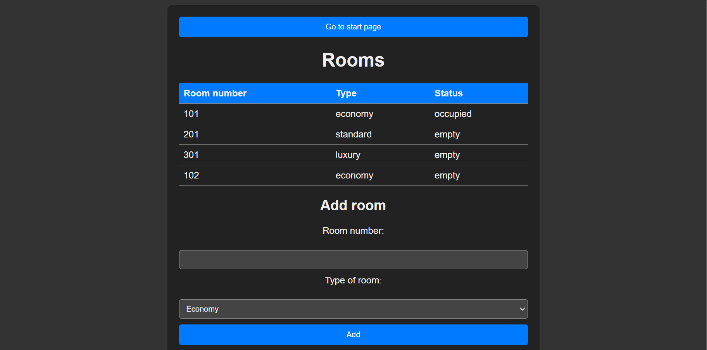
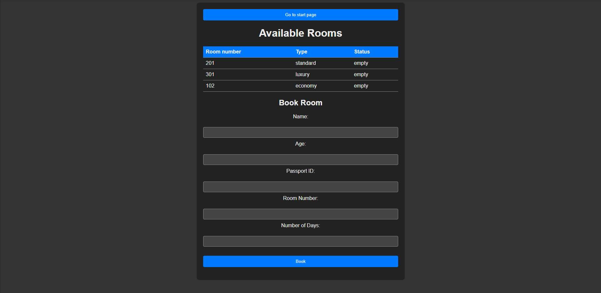
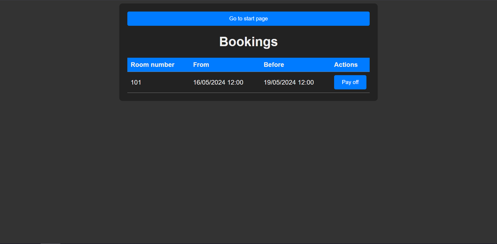
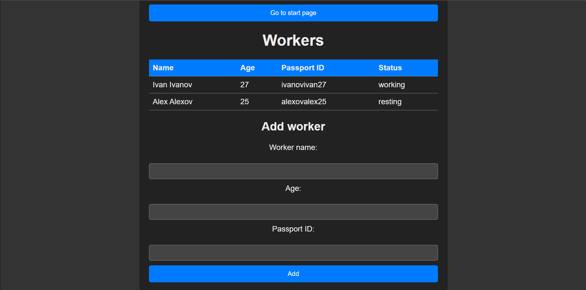
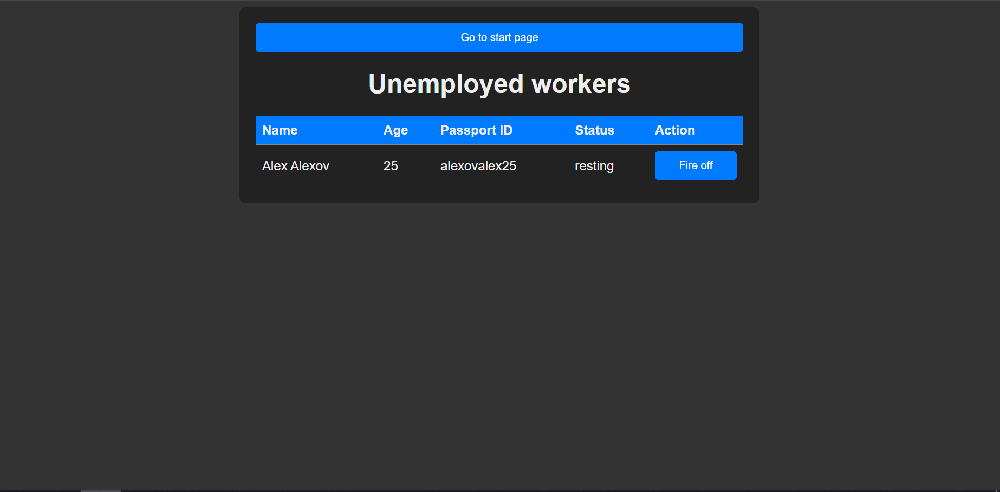
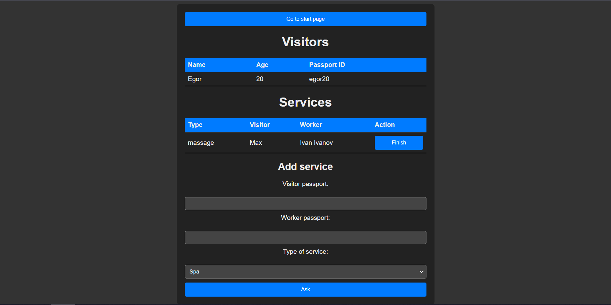
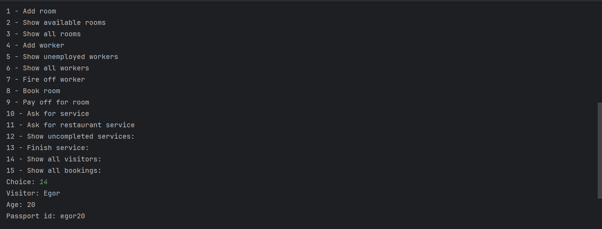

## Лабораторная работа №3

### Вариант: 74 (Модель отеля)

### Цель:
- Изучить архитектурные приемы построения пользовательского интерфейса и принципы создания веб-приложений
### Задач: 
- Необходимо использовать какой-либо фреймворк создания веб-приложений (рекомендуется <ins>Flask</ins>/Django/FastAPI)
- Пользовательский веб-интерфейс должен включать все возможности управления моделью, а также отображения текущего состояния модели из л/р №1.
- Необходимо сохранить/выделить общий код для л/р №1 и л/р №4, продемонстрировать работоспособность CLI и веб-интерфейса с выделенным общим кодом.

### Демонстрация разработанного веб-приложения:
### Главная страница:
- На главной странице нас встречают команды: “Add and show rooms”, “Book and show available rooms”, “Finish and show all bookings”, “Add and show workers”, “Show and fire-off unemployed workers” и “Services and visitors”,

### Add and show rooms:
- Здесь нам отображается текущая информация(Номер комнаты, её тип и статус занятости) по комнатам в отеле. А так же можно добавить новую комнату заполнив поля ниже. После добавления новой комнаты страница перезагрузится и будет отображена новая информация.

### Book and show available rooms:
- Здесь нам отображается текущая информация(Номер комнаты, её тип и статус занятости) по незанятым комнатам в отеле. Заполнив форму ниже регистрируется новый гость и добавляется бронь в таблицу броней. Страница перезагружается и обновляется ифнормация.

### Finish and show all bookings:
Здесь в виде таблицы отображаются все текущие брони. Рядом с каждой бронью отображается кнопка "Pay off", при нажатии которой бронь удаляется и на странице отображается стоимость проживания.

### Add and show workers:
Здесь в виде таблицы отображаются все работники отеля. А так же заполнив форму ниже, добавляется новый сотрудник. После добавления страница перезагружается и отображается новый сотрудник.

### Show and fire-off unemployed workers:
Здесь в виде таблицы отображаются все незанятые работники отеля. Рядом с каждым сотрудником расположена кнопка fire-off, которая увольняет сотрудника.

### Services and visitors:
Здесь в виде таблицы отображаются все гости отеля и все услуги которые оказываются сейчас. Рядом с каждой услугой расположена кнопка "Finish", которая завершает выполнение услуги. Так же заполнив форму ниже можно запросить новую услугу.

### CLI:

Ключевым условием лабораторной работы было предоставить возможность пользователям использовать не только веб-приложение, но и оставить возможность управлять моделью из консоли.
Пример работоспособности консоли:

### Вывод:
При написании данной лабораторной работы я ознакомился с микрофреймворком flask для создания веб-приложений. Flask позволяет программистам быстро писать веб приложения, а так же предоставляет необходимый набор для разработки, позволяет программистом удобно обрабатывать запросы и генерировать ответы используя такой механизм как "шаблоны"(Jinja2). 