# Лабораторная работа 4

## Описание приложения

Система представляет из себя приложение клиент-сервер кадастрового агентства. Посредством веб-интерфейса происходит взаимодействие с бизнес-логикой из ЛР1. 

## Демонстрация работы

### Главное меню

Главное меню приложения, в нём ожно выбрать текущий регион.

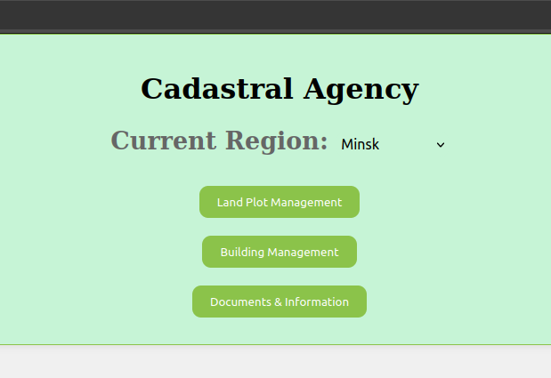

### Ввод пасспортного ID

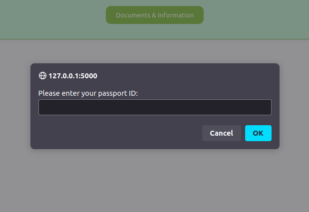

Для того чтобы переёти в любой из пунктов меню пользователю нужно ввести пасспортное ID. При вводе незарегистрированного айди,
пользователя перенаправит на страницу регистрации.

### Регистрация владельца

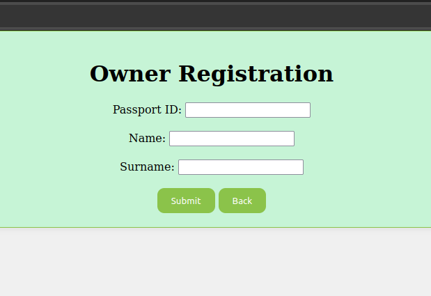

Для регистрации владельца нужно ввести имя, фамилию и пасспортное ID

### Меню управления земельными участками

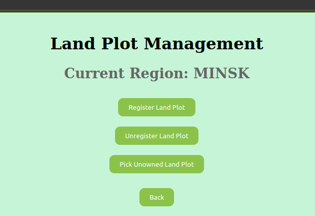

На странице управления земельными участками можно зарегистрировать новый участок, удалить имеющийся, или же выбрать себе незанятый
При нажатии на "Register Land Plot" возникает следующее меню:

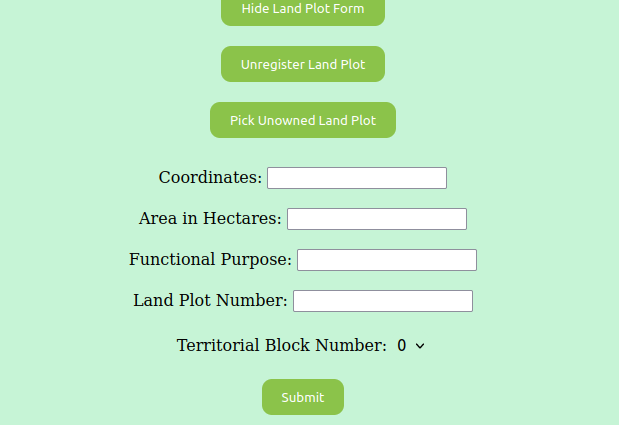

### Меню удаления регистрации участка

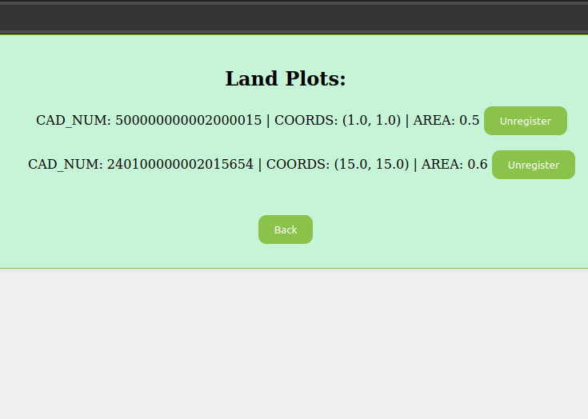

При нажатии на кнопку "Uregister" участок будет снят с регистрации.

Меню взятия незанятого участка работает по схожему принципу:

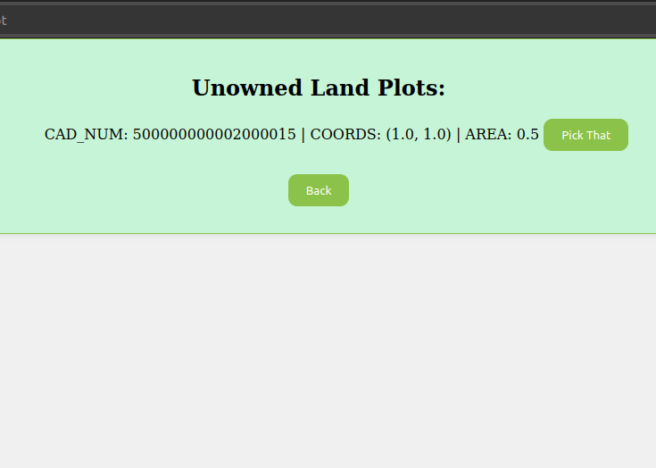

### Меню управления зданиями

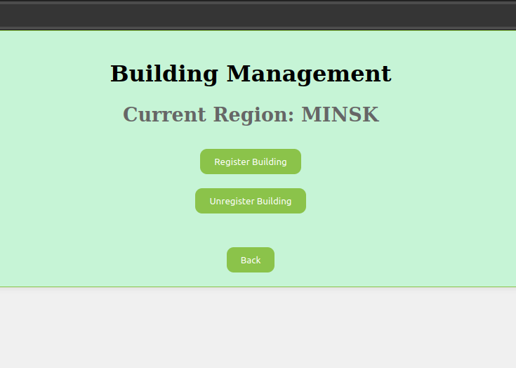

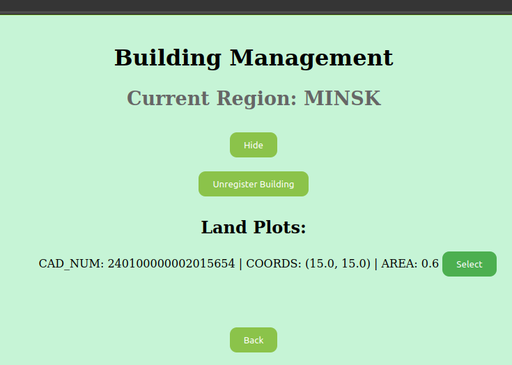

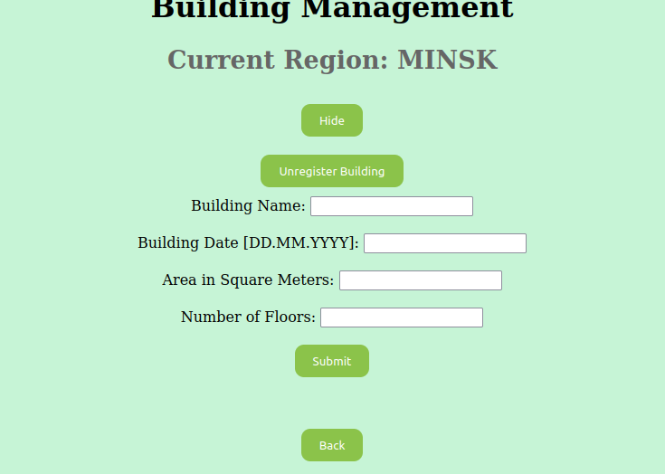

Можно зарегистрировать новое здание. При нажатии на "Register Building" сначала пользователю будет предложено
выбрать земельный участок, на котором нужно зарегистрировать здание, и только после будет открыта форма для регистрации самого здания

### Меню удаления зданий

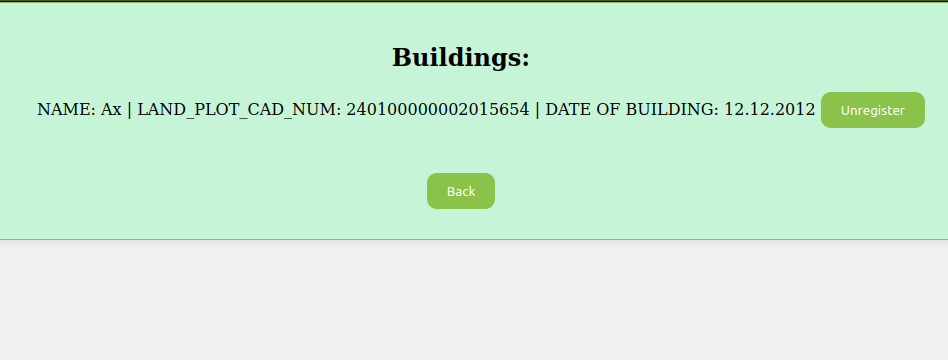

### Меню просмотра информации

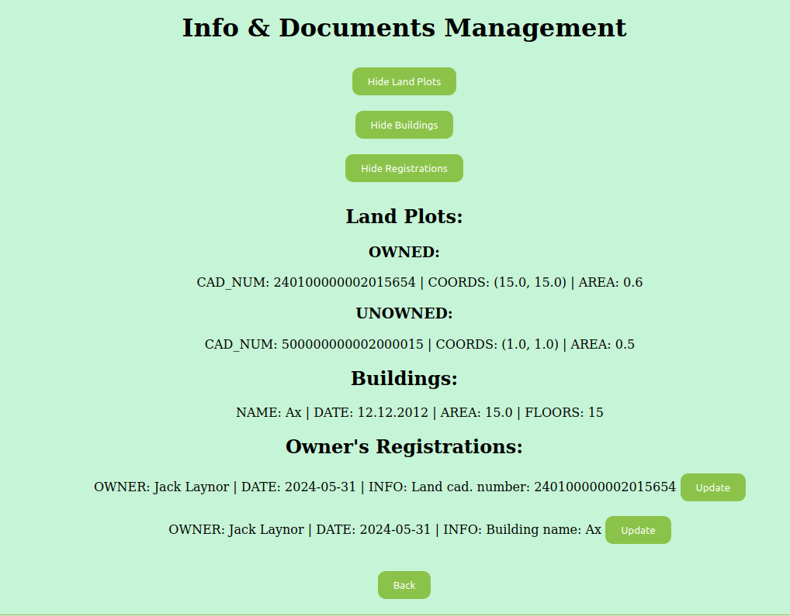

Можно посмотреть на все зарегистрированные земельные участки, занятые и не занятые, а также на все ваши регистрации. Регистрации также можно
обновить кнопкой "update", что поменяет дату регистрации на сегодняшнюю

## Архитектура приложения

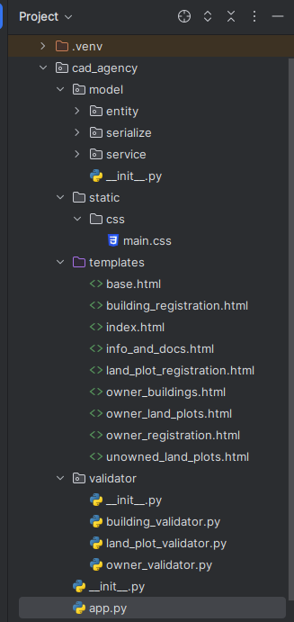

### Общие характеристики

В приложении используется фреймворк Flask для работы веб-сервера.
Приложение разработано с использованием паттерна MVC.

Фреймворк Flask был выбран за лёгкость в изучении и интеграции с уже существующим кодом ЛР 1.

Слой model содержит в себе сущности разработанной предметной области, а также класс CadastralAgency, выступающий в виде репозитория и сервиса,
в неизменённом виде использующегося в ЛР 1

controller представлен в виде маршрутов, обозначенных в app.py

Слой view представлен html-шаблонами Jinja2-templates, которые служат для генерации view по шаблону на основе данных, полученных из бекенда приложения.

Для создания графического интерфейса использован HTML, CSS, а также в незначительной степени Javascript для выполнения AJAX-запросов и перенаправления пользователя на другие страницы.
